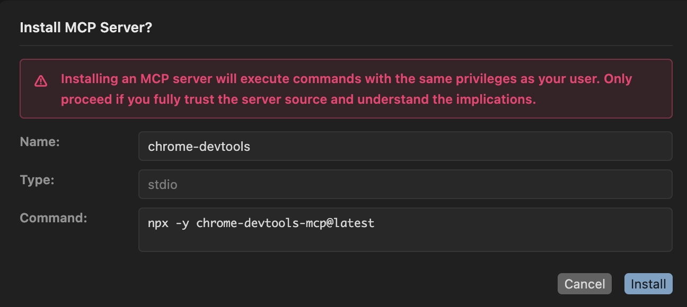
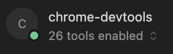

# 在 Cursor 中安装 Chrome DevTools MCP

## 一、配置本地环境

1. 安装最新版 [Chrome 浏览器](https://www.google.com/chrome/)。

2. 安装 v20.19 或更高版本的 [Node.js](https://nodejs.org/)。

3. 安装 [npm](https://www.npmjs.com/)

## 二、一键安装

点击这个按钮：，Curosr 会被打开，并直达安装界面：

点击右下角的「安装」按钮，chrome-devtools MCP 会被安装到你的电脑中。安装成功如图：

如果你看到左下角的圆点是红色或者黄色，或者下方显示「0 tools enabled」，可以重启 Cursor 试试。

如果重启后无效果，请检查第一步的环境配置。