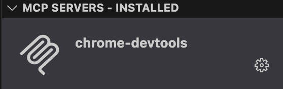
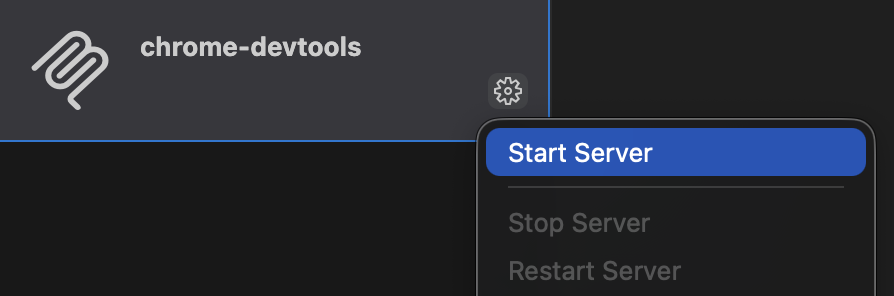
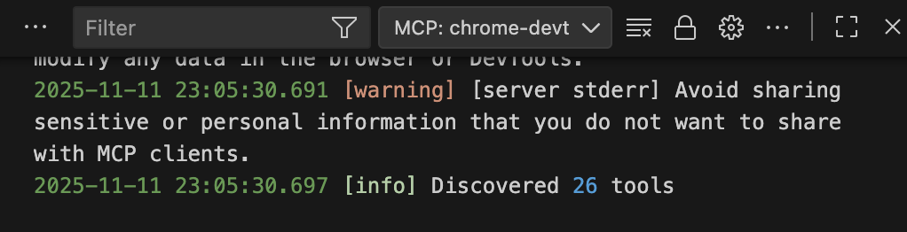

# 在 VS Code 中安装 Chrome DevTools MCP

## 一、配置本地环境

1. 安装最新版 [Chrome 浏览器](https://www.google.com/chrome/)。

2. 安装 v20.19 或更高版本的 [Node.js](https://nodejs.org/)。

3. 安装 [npm](https://www.npmjs.com/)

## 二、一键安装

打开电脑的终端，输入以下命令：

```bash
code --add-mcp '{"name":"chrome-devtools","command":"npx","args":["chrome-devtools-mcp@latest"]}'
```

>    如果运行结果是“command not found: code”，请按下列步骤操作：
>
>    1. 打开 VS Code
>    2. 按 `Cmd + Shift + P` 打开命令面板
>    3. 输入 `Shell Command: Install 'code' command in PATH`
>    4. 选择该命令并按回车
>    5. 重启终端
>    6. 再次运行 `code --add-mcp '{"name":"chrome-devtools","command":"npx","args":["chrome-devtools-mcp@latest"]}'`

打开 VS Code，点击左侧边栏的「扩展」图标进入扩展列表，在下方可以看到安装成功的 chrome-devtools MCP。



点击右下角的齿轮按钮展开菜单：



当看到 VS Code 里输出了如下信息，说明 MCP 已经成功安装：

